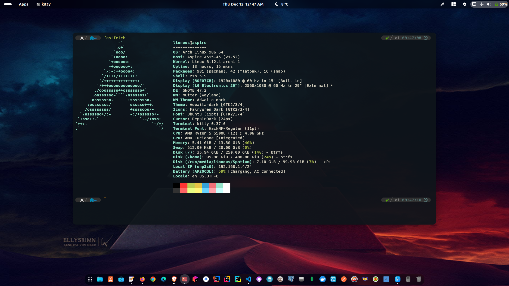
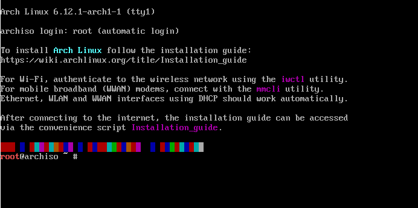

# Arch linux installation

## Description
Arch Linux installation is a manual process that gives users the flexibility to customize their system from scratch. Below are the basic steps:

## Important links
- [Arch Linux Homepage](https://archlinux.org/ "Arch Linux Homepage")
- [Arch Linux Downloads](https://archlinux.org/download/ "Arch Downloads")

## Table of contents
+ Pre-installation
	- [Boating](#boating)
	- [Welcome to the live environment](#welcome-to-the-live-environment)

+ Initial Configuration
	- [Prior verifications](#prior-verifications)
    - [1) Partitions configuration](#1-partitions-configuration)
    - [2) Format partitions](#2-format-partitions)
    - [3) Mounting file systems](#3-mounting-file-systems)

+ Base system configuration
    - [4) Install essential packages](#4-install-essential-packages)
    - [5) Mounting the partitions for system startup](#5-mounting-the-partitions-for-system-startup)
    - [6) Configuring the system: Chroot](#6-configuring-the-system-chroot)

+ System settings
    - [7) Install additional tools and utilities](#7-install-additional-tools-and-utilities)
    - [8) Keyboard settings](#8-keyboard-settings)
    - [9) Creating and configuring groups, users](#9-creating-and-configuring-groups-users)
    - [10) Time zone and region settings](#10-time-zone-and-region-settings)
    - [11) Hostname configuration](#11-hostname-configuration)

+ GRUB
    - [12) Setting up the GRUB bootloader](#12-configuracion-del-grub-bootloader)
    - [13) Reboot](#13-reboot)

+ Post installation
    - [a) Network Configuration and Management](#a-network-configuration-and-management)
    - [b) Installing the graphical interface](#b-installing-the-graphical-interface)
    - [c) Install drivers graphics](#c-install-drivers-graphics)

+ [Additions](#additions)
	- [Flatpak Configuration](#flatpak-configuration)
	- [Optimize Linux Laptop Battery Life](#optimize-linux-laptop-battery-life)
	- [My custom terminal](#my-custom-terminal)

### Boating

1) Download ISO

    Go to the official Arch Linux site and download the latest ISO image from the official downloads section. [Arch Linux Downloads](#important-links)

2) Creation of the installation medium

    Use tools like Rufus, Balena Etcher or Ventoy to create an installation media on a USB or DVD.
    And depending on the boot system of your device such as BIOS or UEFI.

3) Starts from the installation media

    Configure your system to boot from the created media. This is done by setting the boot order in the BIOS or UEFI.

### Welcome to the live environment
When you start arch linux it will vote root as shown in the image.



### Prior verifications
+ Internet verification
```bash
ping -c 1 google.es
ping archlinux.org
```
+ Keyboard verification

    Depending on your keyboard language, you can use the following command loadkeys keyboard language, e.g.
```bash
loadkeys es
loadkeys us
```
> Or you can look it up with the following command `localectl list-keymaps`

+ System clock update

    This command depends on your time zone.
```bash
timedatectl set-timezone America/Lima
```

### 1) Partitions configuration

- Partitioning scheme of your storage device
```bash
cfdisk
```
> * If you want more than 4 partitions, a **GPT** partition is recommended.
> * If you are in a virtual environment, a **DOS** partition is recommended.

- Partitions

> Tip: List of file systems. More info [here](https://wiki.archlinux.org/title/Solid_state_drive#TRIM).

**UEFI with GPT**
| Name |    Mount     |     Suggested Size     | Type |
| :--: | :----------: | :-------------: | :--: |
| nvme0n1p1 | `/boot`  | 1G       | EFI system partition |
| nvme0n1p2 | `swap`      | 4G       | Linux Swap  |
| nvme0n1p3 | `/`         | 32G      | Linux Root x86-64 (Ext4 or Btrfs) |
| nvme0n1p4 | `/home`     | Remaining Space        | Linux Home (Ext4 or Btrfs) |

> More info [here](https://wiki.archlinux.org/title/EFI_system_partition).

**BIOS with MBR**
| Name |    Mount     |     Suggested Size     | Type |
| :--: | :----------: | :-------------: | :--: |
| nvme0n1p2 | `swap`      | 4G       | Linux Swap  |
| nvme0n1p3 | `/`         | 32G      | Linux Root x86-64 (Ext4 or Btrfs) |
| nvme0n1p4 | `/home`     | Remaining Space        | Linux Home (Ext4 or Btrfs) |

> Note: `swap` and `/home` or other partitions are not mandatory if you don't have much storage space.However, `/boot` and `/` or `/root` are necessary for the system's boot and root functions.

### 2) Format partitions

To view the list of partitions
```bash
lsblk
```
- Formatting for **/boot or /efi**
    ```bash
    mkfs.fat -F 32 /dev/nvme0n1p1   #-- boot partition
    ```
- Formatting for **swap**
    ```bash
    mkswap /dev/nvme0n1p2    #-- swap partition
    ```
- Formatting for **/root or /home or others**
    ```bash
    mkfs.btrfs /dev/nvme0n1p3   #-- /root partition
    mkfs.btrfs /dev/nvme0n1p4   #-- /home partition
    ```
> Note: The `Btrfs` and `Ext4` partition schemes, or others, will depend on your preferences.

### 3) Mounting file systems

Swap activation
```bash
swapon /dev/nvme0n1p2   #-- swap activation
```
Mount Point `/mnt` This is a standard directory where temporary file systems can be mounted.

- Assembly of **/boot**
    ```bash
    mkdir /mnt/boot/efi                     #-- Creation of directory
    mount /dev/nvme0n1p1 /mnt/boot/efi      #-- Assembly of /boot
    ```
- Assembly of **/root**
    ```bash
    mount /dev/nvme0n1p3 /mnt           #-- Root mounding
    ```
- Assembly of **/home** or other directories that are similar
    ```bash
    mkdir /mnt/home
    mount /dev/nvme0n1p4 /mnt/home      #-- Root mounding
    ```
> Note: For BIOS you only have to mount swap and root, the above configuration is for GPT with UEFI.

### 4) Install essential packages

> You can update the mirrorlist to optimize downloads. More info [here](https://archlinux.org/mirrorlist/).
```bash
nano /etc/pacman.d/mirrorlist
```

- **Installation of base packages:**
```bash
  pacstrap /mnt base base-devel linux linux-headers linux-firmware mkinitcpio 
  
  pacstrap /mnt amd-ucode     #-- Optional microcodes for AMD processors
  pacstrap /mnt intel-ucode     #-- Optional microcodes for Intel processors
```

- **(Optional) Installation with specific kernels:**
```bash
pacstrap /mnt linux-lts linux-lts-headers  #-- Kernel LTS
pacstrap /mnt linux-zen linux-zen-headers  #-- Kernel Zen
pacstrap /mnt linux-hardened linux-hardened-headers  #-- Kernel Hardened (optional)
```

### 5) Mounting the partitions for system startup

configuration for the partitions located in /mnt
```bash
genfstab -U /mnt >> /mnt/etc/fstab
```

### 6) Configuring the system: Chroot

```bash
arch-chroot /mnt
```

### 7) Install additional tools and utilities

```bash
pacman -S networkmanager
pacman -S wpa_supplicant
pacman -S sudo
pacman -S nano
```

### 8) Keyboard settings

- It is configured in the following files
```bash
nano /etc/vconsole.conf
```
> For your correct keyboard detection add this line: `KEYMAP=en`.

> But you can change it depending on your language like: `KEYMAP=us`.

### 9) Creating and configuring groups, users

+ **Set password to root**
```bash
passwd  #-- Password como root
```
+ **Add a user and change the password of the created user**
```bash
useradd -m <username>     #-- Add a user
passwd <unsername>    #-- User password
```
> Check if the user `ls /home/` was created

+ **Add the created user to a group**
```bash
usermod -aG wheel <unsername>
groups <unsername>
```
+ **Sudoers configuration for group wheel**
```bash
nano /etc/sudoers
```
> Uncomment the `%wheel ALL=(ALL:ALL) ALL` line

### 10) Time zone and region settings

- **Configuration of the regions**

First we go to the configuration of the regions with the following command
```bash
nano /etc/locale.gen
```
Uncomment the lines which are of your preference e.g.
```bash
en_US.UTF-8 UTF-8     #-- reference to the English language
es_PE.UTF-8 UTF-8     #-- reference to the Spanish language
```
Proceed with the following command to save your settings
```bash
locale-gen
```
- **Time zone**

This command creates a symlink from the time zone file corresponding to Lima (in this case, America/Lima) to the /etc/localtime file, you can be dependent on your time zone.

```bash
ln -sf /usr/share/zoneinfo/America/Lima /etc/localtime
hwclock --systohc
```

### 11) Hostname configuration

First install 
```bash
pacman -S inetutils
```
- This command writes the host name (in this case, desktop-name) to the /etc/hostname file.
```bash
echo desktop-name > /etc/hostname
echo desktop-name | sudo tee /etc/hostname
```
- Open the /etc/hosts file in the text editor
```bash
nano /etc/hosts
```
```bash
127.0.0.1    localhost
::.1         localhost
127.0.0.1    desktop-name.localhost desktop-name
```

### 12) Configuracion del GRUB BootLoader

**UEFI**

- Installing GRUB and related tools for uefi
```bash
pacman -S grub os-prober efibootmgr
```
```bash
grub-install --target=x86_64-efi --efi-directory=/boot/efi --bootloader-id=Arch
```
> GRUB installation on the EFI system.
```bash
grub-install --target=x86_64-efi --efi-directory=/boot/efi --removable
```
> Installation of GRUB in “removable” mode, on removable media.

**BIOS**
- Installation of GRUB and related bios tools
```bash
pacman -S grub os-prober dosfstools
```
```bash
grub-install /dev/sda
```

**Save settings**

Depending on the configuration, either uefi or bios, proceed to save the changes.
```bash
grub-mkconfig -o /boot/grub/grub.cfg
```

### 13) Reboot
> If you have reached this point, reboot the system.
```bash
reboot now
```
```bash
poweroff
```
****

### a) Network Configuration and Management

Activation of NetworkManager
```bash
systemctl enable NetworkManager #-- Enables the NetworkManager service.
systemctl start NetworkManager  #-- Start the NetworkManager service.
```
Enabling wpa_supplicant
```bash
systemctl enable wpa_supplicant.service #-- Enables the wpa_supplicant service.
systemctl start wpa_supplicant.service  #-- Start the wpa_supplicant service.
```

System Upgrade
```bash
sudo pacman -Syu
```

### b) Installing the graphical interface

**Installs the X window system (Xorg) and X server (xorg-server) required to run graphical environments on Linux.**
```bash
pacman -S xorg xorg-server
```
**Proceed with the installation of one of the Desktop Environments:**

- [Budgie](https://wiki.archlinux.org/index.php/Budgie): `sudo pacman -S gdm budgie-desktop`
- [Cinnamon (please read)](https://wiki.archlinux.org/index.php/Cinnamon#Installation): `sudo pacman -S cinnamon lightdm`
- [Deepin (please read)](https://wiki.archlinux.org/index.php/Deepin#Installation): `sudo pacman -S deepin deepin-extra lightdm`
- [GNOME](https://wiki.archlinux.org/index.php/GNOME): `sudo pacman -S gnome gnome-extra`
- [KDE Plasma](https://wiki.archlinux.org/index.php/KDE_Plasma): `sudo pacman -S plasma kde-applications sddm`
- [LXDE](https://wiki.archlinux.org/index.php/LXDE): `sudo pacman -S lxde lxdm`
- [LXQt](https://wiki.archlinux.org/index.php/LXQt): `sudo pacman -S lxqt breeze-icons sddm`
- [MATE](https://wiki.archlinux.org/index.php/MATE): `sudo pacman -S mate mate-extra lightdm`
- [XFCE](https://wiki.archlinux.org/index.php/Xfce): `sudo pacman -S xfce4 xfce4-goodies lightdm`

**After installing Xorg, a Desktop Environment and its dependencies, enable the Display Manager**
  - GDM (Budgie, GNOME): `sudo systemctl enable gdm`
  - LightDM (Cinnamon, Deepin, MATE, XFCE): `sudo systemctl enable lightdm`
  - LXDM (LXDE): `sudo systemctl enable lxdm`
  - SDDM (KDE Plasma, LXQt): `sudo systemctl enable sddm`

**Start the Display Manager**
  - GDM (Budgie, GNOME): `sudo systemctl start gdm`
  - LightDM (Cinnamon, Deepin, MATE, XFCE): `sudo systemctl start lightdm`
  - LXDM (LXDE): `sudo systemctl start lxdm`
  - SDDM (KDE Plasma, LXQt): `sudo systemctl start sddm`

## c) [Install drivers graphics](https://wiki.archlinux.org/index.php/Xorg#Driver_installation)

+ **AMD**
```bash
sudo pacman -S mesa xf86-input-libinput xf86-video-ati xf86-video-amdgpu vulkan-radeon amd-ucode
```
+ **Intel**
```bash
sudo pacman -S mesa xf86-input-libinput xf86-video-intel vulkan-intel intel-ucode
```
+ **NVIDIA**
```bash
sudo pacman -S mesa xf86-input-libinput nvidia xf86-video-nouveau nvidia-utils
```

## c) [Install audio sound system](https://wiki.archlinux.org/index.php/Xorg#Driver_installation)

You can install the most popular ones or according to your preferences, for example.
```bash
sudo pacman -S pipewire pipewire-alsa pipewire-pulse
```
```bash
sudo pacman -S pulseaudio pulseaudio-alsa alsa-utils
```
+ **Ahora Habilitar y activar**
```bash
sudo systemctl --user stop pulseaudio.service
sudo systemctl --user disable pulseaudio.service
```
```bash
sudo systemctl --user enable pipewire.service
sudo systemctl --user start pipewire.service
```
****

## Additions
This configuration is only for the GNOME environment.

### [Flatpak Configuration](https://flatpak.org/setup/)

+ **Install Flatpak**
```bash
sudo pacman -S flatpak
```
+ **Restart**
```bash
sudo reboot
```
+ **Installing programs with flathub**
    - [Extensions](https://flathub.org/apps/org.gnome.Extensions): `flatpak install flathub org.gnome.Extensions`
    - [ExtensionManager](https://flathub.org/apps/com.mattjakeman.ExtensionManager): `flatpak install flathub com.mattjakeman.ExtensionManager`
    - [Mission Center](https://flathub.org/apps/io.missioncenter.MissionCenter): `flatpak install flathub io.missioncenter.MissionCenter`

+ **Install Snap Store**

    You can also install the snap-store application store. The directions are shown in the following link. [Snap Store](https://snapcraft.io/install/snap-store/arch)


### [Installing extensions](https://extensions.gnome.org/)

The list of extensions you might be interested in, but you can also install it through the ExtensionManager application if you have installed it before.

> If it is not found in the application you can also search for it in... More info [here](https://extensions.gnome.org/).

- App menu is back
- Auto Activities
- Blur my Shell
- Dash to Dock
- Grand Theft Focus
- Just Perfection
- Lock Keys
- Logo Menu
- Rouded Window Corners Reborn
- Tilin Shell
- Weather or Not
- Focus
- Vitals

### [Optimize Linux Laptop Battery Life](https://linrunner.de/tlp/index.html)

+ **Installation of tlp**
```bash
sudo pacman -S tlp
```
```bash
sudo pacman -S tlp-rdw  #-- TLP graphical interface
```
> You can also install the graphical interface via flathub... [here](https://flathub.org/apps/com.github.d4nj1.tlpui).

```bash
sudo systemctl enable tlp   # Enables TLP at startup
sudo systemctl start tlp    # Starts TLP
```
### My custom terminal

+ [**Configuración de zsh**](https://github.com/ohmyzsh/ohmyzsh/wiki/Installing-ZSH)
    ```bash
    sudo pacman -S zsh  #-- Installation of zsh
    ```
    ```bash
    sudo nano ~/.zshrc  #-- Edit from zsh
    ```
    > View configuration script [.zshrc](scripts/.zshrc)

    For its correct operation, install the following plugins
    ```bash
    sudo pacman -S zsh-syntax-highlighting
    sudo pacman -S zsh-autosuggestions
    ```
    + Download the following path for the following plugin

        [sudo.plugin.zsh](https://github.com/ohmyzsh/ohmyzsh/blob/master/plugins/sudo/sudo.plugin.zsh)
    
    > Once you have the plugins, configure the routes for their operation, which by default are as follows:

    + source /usr/share/zsh/plugins/zsh-syntax-highlighting/zsh-syntax-highlighting.zsh
    + source /usr/share/zsh/plugins/zsh-autosuggestions/zsh-autosuggestions.zsh
    + source /usr/share/zsh/plugins/zsh-sudo/sudo.plugin.zsh

    **Optional**
    Installation of [powerlevel10k](https://github.com/romkatv/powerlevel10k)

    **See more details in 🏷️ [zsh](https://s4vitar.github.io/bspwm-configuration-files/#)** 


+ [**Configuracion de kitty**](https://sw.kovidgoyal.net/kitty/)
    
    Installation of kitty through pacman
    ```bash
    sudo pacman -S kitty
    ```
    Go to the path and change your `username` with yours.
    ```bash
    cd /home/username/.config/kitty/
    ```
    > In the directed path, download or create the following files

    + [kitty.conf](scripts/kitty.conf) : Kitty configurations.
    + [ayu.conf](scripts/ayu.conf) : Theme settings.

    > You can find more kitty themes here [kitty-themes](https://github.com/dexpota/kitty-themes)


    **For more configuration details see the following 🏷️ [s4vitar](https://youtu.be/fshLf6u8B-w) Thank you for your hard work and contributions!** 

